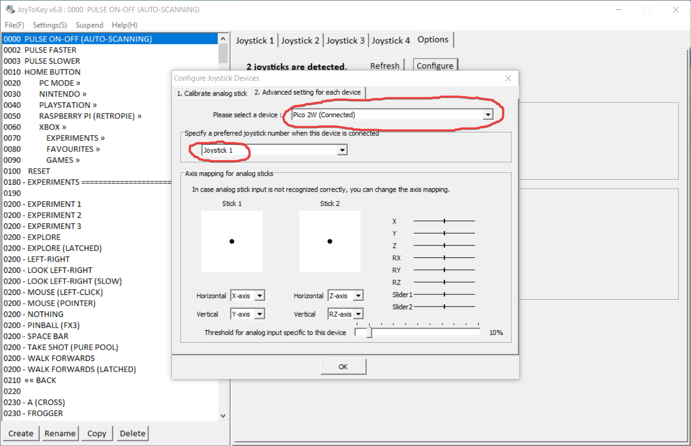
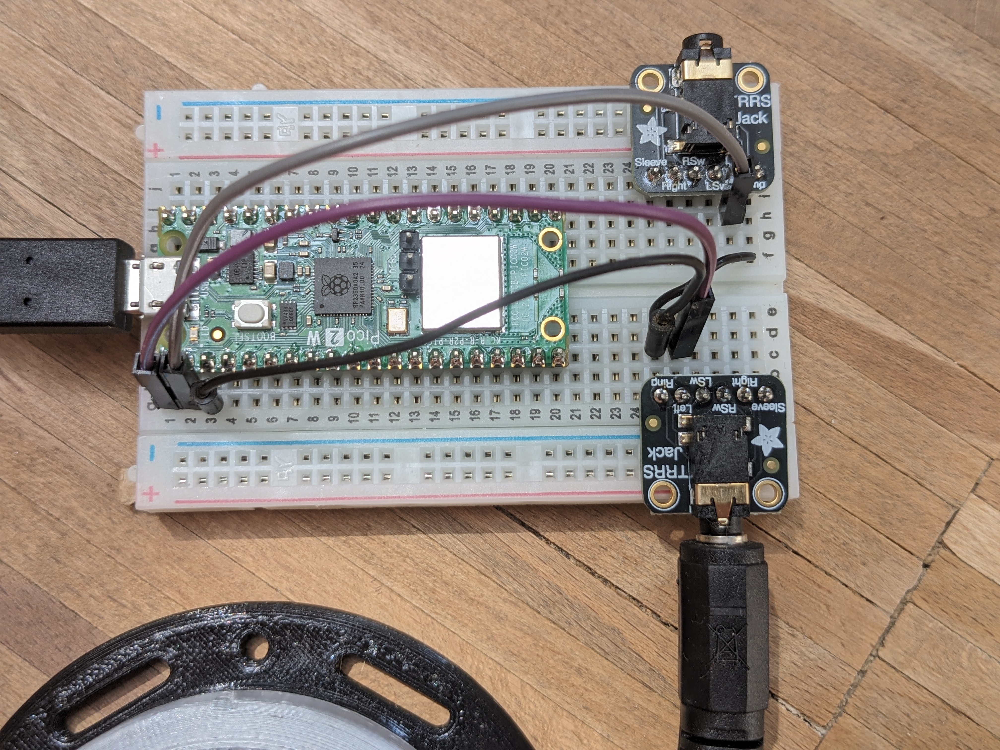

# picoPulse

**picoPulse** supports accessible gaming using a single switch interface, powered by the [OneSwitchPulse](https://oneswitch.org.uk/page/one-switch-pulse) system. It is using a Raspberry Pi Pico microcontroller as input device. The RP Pico is recognized by the PC as gamepad, and creates gamepad button presses. The _JoyToKey_ application dynamically maps the function of the primary user button to different keyboard or mouse actions, depending on the current mode or game state. Keyboard actions are then captured by the _GTuner_ software, which controls the [Titan Two](https://www.consoletuner.com/products/titan-two/) game controller adapter. The _Titan Two_ can be connected to various gaming consoles or a secondary PC, where the desired game control actions are performed.

## Getting Started

1. **Hardware Requirements**
    - _Titan Two_ gaming adapter with profile settings by OneSwitch.org.uk
    - Raspberry Pi Pico microcontroller (or a similar RP2040/RP2350 based development board) + USB cable
    - One assistive switch/button for making selections connected to GP0 (Pin 1) - e.g. via a 3,5 mm jack plug connector 
    - Optional: 
        - Connect a button to GP1 (pin 2) for manual pulsing
        - Connect a button to GP2 (pin 4) for starting/stopping automatic pulsing at any time
        - Connect a button to GP3 (pin 5) for decreasing pulse time  
        - Connect a button to GP4 (pin 6) for increasing pulse time
        - Connect a piezo-buzzer to GP5 (pin 7) for receiving auditory feedback
    - Note: connect the other pin of the buttons (or buzzer) to GND - e.g. pin 3. Pin numbers are given for the original [RP Pico boards](https://docs.micropython.org/en/latest/_images/pico_pinout.png).
    - The [FABI](https://github.com/asterics/FABI) device could be used instead of a bare RP Pico board. The FABI board supports better user feedback (LCD, buzzer/tones, Neopixel LED) and offers 5 jack plug connectors. (For the FABI, a dedicated firmware file is provided.)

2. **Installation**
    - Download the [OneSwitchPulse](https://oneswitch.org.uk/page/one-switch-pulse) software package from OneSwitch.org.uk, and extract the .zip file in a folder of your choice
    - Download [picoPulse.zip](https://github.com/asterics/PicoPulse/releases/latest/download/picoPulse.zip) and extract the content **to the same folder** as the OneSwitchPulse package (this should overwrite some files of the JoyToKey configuration settings)
    - Install the firmware on your Raspberry Pi Pico:
        - Press and hold the white _Bootsel_ button when you plug in the USB cable; a USB drive should open.
        - Copy the firmware file (.uf2) onto this drive (into the root folder, can by done via drag-and-drop).
        - For the RP Pico / PicoW, use the file `picoPulse_Firmware/picoPulse_2040.ino.uf2`
        - For the RP Pico2 / Pico2W, use the file `picoPulse_Firmware/picoPulse_2350.ino.uf2`
	- When you start _JoyToKey_ for the first time, make sure that the RP Pico is recognized as _Joystick 1_. This can be configured in the _JoyToKey_ options dialog, see image `JoyToKey_JoystickConfig.png`

3. **Usage**
    - Start _picoPulse_, _JoyToKey_ and _GTuner_:
        - right-click `pulseControl.exe` in the subfolder `picoPulse/pulseControl` and select _run as administrator_
        - right-click `( JoyToKey - RUN AS ADMIN ).exe` in the subfolder `2 JoyToKey` and select _run as administrator_
		- double-click `3 GtunerIV/Gtuner.exe`
        - Optionally you can use the `startPicoPulse.exe` to run all 3 applications. It should ask you for permissions to start two other applications with admin privileges.
        - Note: Some anti-virus software prevent the start of the applications because they use key injection and other techniques (which is not harmful in this case). Allow the execution of these programs - if necessary by changing the quarantine settings of your antivirus software.
        - The icon of the _pulseControl_ application should appear in the system tray. This software provides Hotkeys for controlling the pulse scanning and audio feedback. Right-click the icon to see options. 
        - The _JoyToKey_ application and the _GTuner_ application should have opened. In the JoyToKey application, the first configuration profile ("0000 PULSE ON-OFF ..") should be active, and the RP Pico device should be registered as the first joystick. The order can be changed in the Options of JoyToKey (Options -> Configure -> Advanced Settings). Please refer to the documentation of the OneSwitchPulse system for details.  
    - Choose the correct profile in the _Gtuner_ application (e.g. profile 4 for using a PlayStation 4 console).
    - Enable **KMG capture** in the GTuner Tools menu. Make sure that the _GTuner_ application has the focus (it's window is active/selected).
    - The system should now be operational. The primary button can be used to start/stop pulse scanning, and then performs other actions depending to the current (game-) mode.
    - The supported Hotkeys processed by the _pulseControl_ software are: (these Hotkeys are also emitted by _JoyToKey_)
        - `Shift+F11`: pulse start/stop
        - `Shift+F10`: decrease pulse time (faster)
        - `Shift+F9`: increase pulse time (slower)
        - `Shift+F8`: enable / disable audio click

## License

This project is licensed under the GPLv3 License.

## Acknowledgements

Thanks to [OneSwitch.org.uk](https://OneSwitch.org.uk) and [CelticMagic](https://celticmagic.org) for their great work in adaptive gaming and the delvelopment of the OneSwitchPulse system.
